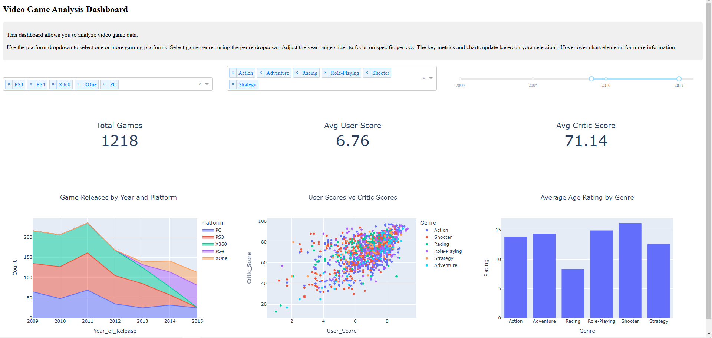

# Dash Games Market Dashboard

## Project Description

This project is an interactive dashboard for analyzing video game data stored in the `games.csv` file. It provides various charts and key metrics on the number of games, user and critic scores, and the average age rating by genre.

## Project Structure

- `games_market_dash_Dm_Ch.py`: The main script to run the Dash application.
- `games.csv`: A data file containing video game information.
- `requirements.txt`: A list of the project's dependencies.
- `Dockerfile`: Used to containerize the application with Docker.

## Setup and Run

### Local Setup

1. Make sure you have Python 3.9 or above installed.
2. Install the necessary dependencies:

   ```bash
   pip install -r requirements.txt
   ```

3. Run the application:

   ```bash
   python games_market_dash_Dm_Ch.py
   ```

4. Open your browser and go to `http://127.0.0.1:8050/`.

### Running with Docker

1. Make sure Docker is installed.
2. Build the Docker image:

   ```bash
   docker build -t dash-games-market .
   ```

3. Run the container:

   ```bash
   docker run -d -p 8050:8050 dash-games-market
   ```

4. Open your browser and go to `http://your_server_ip:8050/`.

## Dashboard Usage

1. Select platform(s) from the "Select platforms" dropdown menu.
2. Select genres from the "Select genres" dropdown menu.
3. Adjust the year range using the slider to focus on specific years.
4. All metrics and charts update based on your selections.

## Dependencies

The application uses the following main libraries:
- Dash
- Plotly
- Pandas
- NumPy
